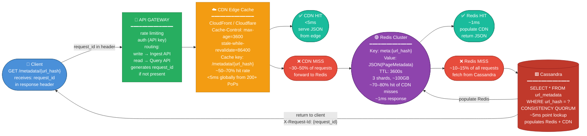
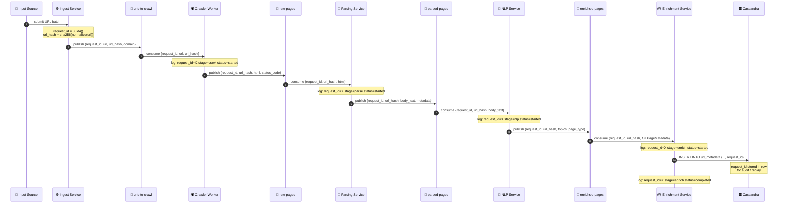
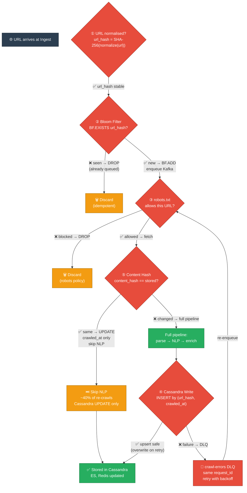
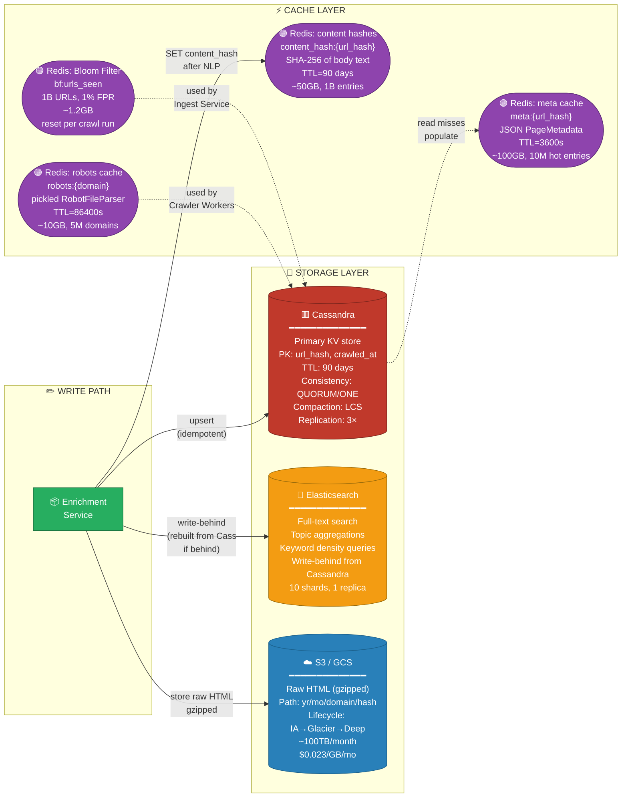

# Architecture Visual — BrightEdge Billion-URL Crawler

> Mermaid diagrams with meaningful shapes: cylinders for databases, queues for Kafka topics,
> rounded boxes for services, hexagons for caches.
> All payloads carry a `request_id` (UUID) for end-to-end tracing without X-Ray or Jaeger.

---

## Diagram 1 — Full Write Pipeline (Ingest → Storage)

```mermaid
flowchart TD
    classDef input      fill:#4A90D9,stroke:#2C5F8A,color:#fff,rx:8
    classDef service    fill:#27AE60,stroke:#1A7A40,color:#fff,rx:6
    classDef queue      fill:#E67E22,stroke:#A85A0F,color:#fff
    classDef cache      fill:#8E44AD,stroke:#5E2D7A,color:#fff
    classDef storage    fill:#C0392B,stroke:#8B1A1A,color:#fff
    classDef detector   fill:#16A085,stroke:#0D6B5A,color:#fff
    classDef dlq        fill:#E74C3C,stroke:#A93226,color:#fff
    classDef nlp        fill:#2980B9,stroke:#1A5E8A,color:#fff
    classDef enrich     fill:#F39C12,stroke:#B7770D,color:#fff

    %% ── INPUT SOURCES ───────────────────────────────────────────
    TXT[("📄 Text File\n(line-by-line generator)")]:::input
    SQL[("🗄️ MySQL\n(batch cursor, 10K rows)")]:::input

    %% ── INGESTION SERVICE ────────────────────────────────────────
    INGEST["⚙️ INGESTION SERVICE\n━━━━━━━━━━━━━━━━━━━━\n① normalize_url() → url_hash\n② assign request_id = UUID\n③ BF.EXISTS → drop if seen\n④ BF.ADD + enqueue Kafka\npartition_key = domain"]:::service

    %% ── BLOOM FILTER ─────────────────────────────────────────────
    BLOOM(["🔵 Redis Bloom Filter\nbf:urls_seen\n1B URLs, 1% FPR\n~1.2 GB RAM"]):::cache

    %% ── KAFKA: urls-to-crawl ─────────────────────────────────────
    KURL[/"📨 Kafka: urls-to-crawl\npartition_key = domain\nRetention: 7 days\nPayload: { request_id, url,\nurl_hash, domain, submitted_at }"\]:::queue

    %% ── CRAWLER WORKERS ──────────────────────────────────────────
    CRAWL["🕷️ CRAWLER WORKERS\n━━━━━━━━━━━━━━━━━━━━\naiohttp async, K8s Deployment\nper-domain token bucket (1 req/s)\nrobots.txt cache → Redis\ntenacity retry 3× exp backoff\nForwards request_id downstream"]:::service

    ROBOTS(["🤖 Redis: robots cache\nrobots:{domain}\nTTL = 24h"]):::cache

    %% ── DUAL OUTPUT ──────────────────────────────────────────────
    S3[("☁️ S3 / GCS\nRaw HTML\ngzipped\nkey = url_hash\nyr/mo/domain/hash.html.gz")]:::storage
    KRAW[/"📨 Kafka: raw-pages\npartition_key = url_hash\nRetention: 3 days\nPayload: { request_id, url_hash,\nhtml, status_code, crawled_at,\nduration_ms }"\]:::queue

    %% ── FAN-OUT ──────────────────────────────────────────────────
    CHANGE["🔍 CHANGE DETECTOR\n━━━━━━━━━━━━━━━━━━━━\ncontent_hash = SHA-256(body)\ncompare vs Redis store\nif same → skip NLP (~40%)\nif diff → forward to parsing"]:::detector

    CHASH(["🟣 Redis: content hashes\ncontent_hash:{url_hash}\nTTL = 90 days"]):::cache

    PARSE["🔎 PARSING SERVICE\n━━━━━━━━━━━━━━━━━━━━\ntrafilatura — clean body text\nBeautifulSoup — title, meta,\nh1-h3, OG, canonical, JSON-LD,\ninternal/external link counts\nSEO flags: thin content,\ntitle/meta length warnings"]:::service

    %% ── KAFKA: parsed-pages ──────────────────────────────────────
    KPARSED[/"📨 Kafka: parsed-pages\npartition_key = url_hash\nRetention: 3 days\nPayload: { request_id, url_hash,\nbody_text, metadata_struct,\nseo_flags }"\]:::queue

    %% ── NLP SERVICE ──────────────────────────────────────────────
    NLP["🧠 NLP SERVICE\n━━━━━━━━━━━━━━━━━━━━\nKeyBERT (all-MiniLM-L6-v2)\n+ MMR diversity (top 10)\nTF-IDF fallback (sklearn)\nkeyword_density computation\npage_type classifier\n(URL path + body signals)"]:::nlp

    %% ── KAFKA: enriched-pages ────────────────────────────────────
    KENRICH[/"📨 Kafka: enriched-pages\npartition_key = url_hash\nRetention: 3 days\nPayload: { request_id, url_hash,\ntopics, page_type, tfidf_keywords,\nkeyword_density, full PageMetadata }"\]:::queue

    %% ── ENRICHMENT SERVICE ───────────────────────────────────────
    ENRICH["📦 ENRICHMENT SERVICE\n━━━━━━━━━━━━━━━━━━━━\nassemble full PageMetadata\ndual write: Cassandra + ES\nRedis SET content_hash\nlog request_id → completed"]:::enrich

    %% ── DLQ ──────────────────────────────────────────────────────
    KDLQ[/"🚨 Kafka: crawl-errors\nDLQ — partition_key = domain\nRetention: 30 days\nPayload: { request_id, url,\nerror, retry_count, stage }"\]:::dlq

    RETRY["♻️ RETRY CONSUMER\n━━━━━━━━━━━━━━━━━━━━\nretry_count 1 → 5 min delay\nretry_count 2 → 30 min\nretry_count 3 → 2 hours\nretry_count 4 → 24 hours\nretry_count 5 → DEAD (alert)\nreuses same request_id"]:::dlq

    %% ── STORAGE LAYER ────────────────────────────────────────────
    CASS[("🟥 Cassandra\nurl_metadata table\nPK: (url_hash, crawled_at)\nConsistency: QUORUM read\nONE write\nTTL: 90 days")]:::storage

    ES[("🔴 Elasticsearch\npage_metadata index\nfull-text + topic search\naggregations by domain\nwrite-behind from Cassandra")]:::storage

    %% ── EDGES ────────────────────────────────────────────────────
    TXT --> INGEST
    SQL --> INGEST
    INGEST <-->|"BF.EXISTS / BF.ADD"| BLOOM
    INGEST --> KURL
    KURL --> CRAWL
    CRAWL <-->|"GET robots.txt\n(cached)"| ROBOTS
    CRAWL -->|"raw HTML"| S3
    CRAWL -->|"on success"| KRAW
    CRAWL -->|"on failure"| KDLQ
    KRAW --> CHANGE
    KRAW --> PARSE
    CHANGE <-->|"GET / SET\ncontent_hash"| CHASH
    CHANGE -->|"page changed\nforward"| PARSE
    PARSE --> KPARSED
    KPARSED --> NLP
    NLP --> KENRICH
    KENRICH --> ENRICH
    ENRICH -->|"upsert"| CASS
    ENRICH -->|"write-behind"| ES
    ENRICH <-->|"SET content_hash"| CHASH
    KDLQ --> RETRY
    RETRY -->|"re-enqueue\nwith same request_id"| KURL
```



---

## Diagram 2 — Read Path (Client → Response)



---

## Diagram 3 — `request_id` Propagation (Single-Point Tracking)

> **Why `request_id` over AWS X-Ray or Jaeger**: X-Ray costs $5/million traces.
> At 1B crawls/month that's **$5,000/month just for tracing**. A UUID in every Kafka
> payload + structured log costs $0 in infra. Grep or CloudWatch Logs Insights finds
> any request in seconds.



---

## Diagram 4 — Idempotency Control Points



---

## Diagram 5 — Database + Cache Ecosystem



---

## Diagram 6 — Kafka Topic Architecture

```mermaid
graph LR
    classDef producer fill:#27AE60,stroke:#196F3D,color:#fff
    classDef topic    fill:#E67E22,stroke:#A85A0F,color:#fff
    classDef consumer fill:#2980B9,stroke:#1A5F8A,color:#fff
    classDef dlq      fill:#E74C3C,stroke:#A93226,color:#fff

    INGEST["⚙️ Ingest Service\n(producer)"]:::producer
    CRAWL["🕷️ Crawler Workers\n(producer)"]:::producer
    PARSE["🔎 Parsing Service\n(producer)"]:::producer
    NLP["🧠 NLP Service\n(producer)"]:::producer
    ENRICH["📦 Enrichment Service\n(producer)"]:::producer
    RETRY["♻️ Retry Consumer\n(consumer + producer)"]:::consumer

    T1[/"📨 urls-to-crawl\npartition: domain\nretention: 7d\npayload: {request_id,\nurl, url_hash, domain}"\]:::topic

    T2[/"📨 raw-pages\npartition: url_hash\nretention: 3d\npayload: {request_id,\nurl_hash, html,\nstatus_code, duration_ms}"\]:::topic

    T3[/"📨 parsed-pages\npartition: url_hash\nretention: 3d\npayload: {request_id,\nurl_hash, body_text,\nmetadata, seo_flags}"\]:::topic

    T4[/"📨 enriched-pages\npartition: url_hash\nretention: 3d\npayload: {request_id,\nurl_hash, topics,\npage_type, tfidf_kw,\nfull PageMetadata}"\]:::topic

    T5[/"🚨 crawl-errors (DLQ)\npartition: domain\nretention: 30d\npayload: {request_id, url,\nerror, retry_count, stage,\nfailed_at}"\]:::dlq

    INGEST -->|"assign\nrequest_id"| T1
    T1 --> CRAWL
    CRAWL -->|"forward\nrequest_id"| T2
    CRAWL -->|"on failure\nrequest_id preserved"| T5
    T2 --> PARSE
    PARSE -->|"forward\nrequest_id"| T3
    T3 --> NLP
    NLP -->|"forward\nrequest_id"| T4
    T4 --> ENRICH
    ENRICH -->|"on failure\nrequest_id preserved"| T5
    T5 --> RETRY
    RETRY -->|"re-enqueue\nsame request_id"| T1
```



---

## `request_id` Schema — Every Kafka Payload

The `request_id` is a UUID v4 assigned at ingest. It flows unchanged through every stage.
No sidecar, no instrumentation agent, no per-request cost.

### Base payload (all topics extend this)

```python
@dataclass
class CrawlEvent:
    request_id: str       # UUID4 — assigned at ingest, never changes
    url_hash:   str       # SHA-256(normalized_url) — immutable identity
    url:        str       # original submitted URL
    domain:     str       # e.g. "amazon.com"
    submitted_at: str     # ISO-8601 — when the URL entered the system
    stage:      str       # current stage: ingest|crawl|parse|nlp|enrich|error
    stage_started_at: str # ISO-8601 — when this stage began
```

### What gets logged at each stage (structured JSON → any log aggregator)

```json
{
  "request_id":       "f47ac10b-58cc-4372-a567-0e02b2c3d479",
  "url_hash":         "abc123...",
  "url":              "https://www.rei.com/blog/camp/how-to-...",
  "domain":           "rei.com",
  "stage":            "nlp",
  "stage_started_at": "2026-06-06T14:23:01.412Z",
  "stage_completed_at": "2026-06-06T14:23:01.804Z",
  "duration_ms":      392,
  "status":           "completed",
  "topics_extracted": 10,
  "page_type":        "article"
}
```

### Tracing a URL through the full pipeline — $0 cost

```bash
# All stages for a single URL — just grep the log aggregator
grep '"request_id": "f47ac10b-..."' /logs/*.jsonl | jq '{stage, status, duration_ms}'

# Output:
# { "stage": "ingest",  "status": "completed", "duration_ms": 2    }
# { "stage": "crawl",   "status": "completed", "duration_ms": 412  }
# { "stage": "parse",   "status": "completed", "duration_ms": 85   }
# { "stage": "nlp",     "status": "completed", "duration_ms": 392  }
# { "stage": "enrich",  "status": "completed", "duration_ms": 18   }
```

### Finding a stuck or failed URL

```bash
# What URLs never completed? (in Cassandra or log query)
SELECT url, request_id, stage, error
FROM url_metadata
WHERE status = 'error'
  AND domain = 'amazon.com'
LIMIT 100;

# Replay a failed request_id through the DLQ:
# crawl-errors has the full payload including request_id
# Retry Consumer re-enqueues it with the same request_id → same row in Cassandra
```

### `request_id` stored in Cassandra

```cql
ALTER TABLE url_metadata ADD request_id TEXT;

-- Query: "show me all crawls initiated from batch job X"
-- (if batch_id is prefixed into request_id: "batchX:uuid4")
SELECT url, crawled_at, page_type, topics
FROM url_metadata
WHERE request_id = 'f47ac10b-...'  -- requires SAI index or ES query
ALLOW FILTERING;
```

> **Note on ALLOW FILTERING**: For production, add a Cassandra SAI (Storage-Attached Index)
> on `request_id`, or query via Elasticsearch where `request_id` is a `keyword` field.
> The primary access pattern (by `url_hash`) is always O(1) — this is an audit/debug query only.

---

## Cost Comparison: `request_id` Logs vs Distributed Tracing

| Approach | Monthly cost at 1B crawls | Complexity |
|---|---|---|
| AWS X-Ray | $5,000+ (at $5/million traces) | Sidecar agents, SDK instrumentation |
| Jaeger (self-hosted) | ~$500 (infra for Jaeger cluster) | Kafka integration, retention storage |
| **`request_id` in structured logs** | **~$0 incremental** | Single UUID field in every payload |

**What you give up**: X-Ray and Jaeger give you a visual flame graph of latency per span.
With `request_id` logs you do the same in a log query — you see `duration_ms` per stage
in a table. For a crawl pipeline (not a latency-sensitive user-facing API), this is sufficient
and the $5,000/month saving is real.

**What you keep**: Full audit trail, failure root-cause, stage-by-stage timing,
DLQ replay with the same `request_id` (no new UUID on retry = complete lineage).
